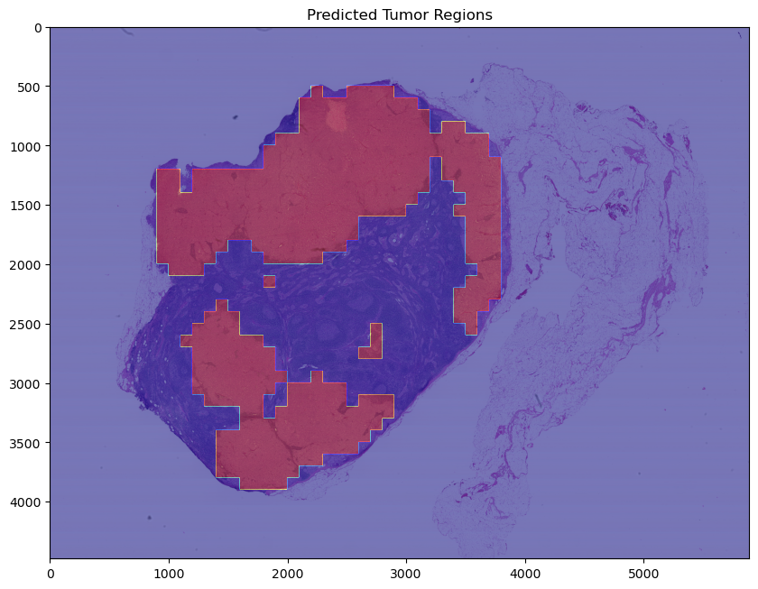
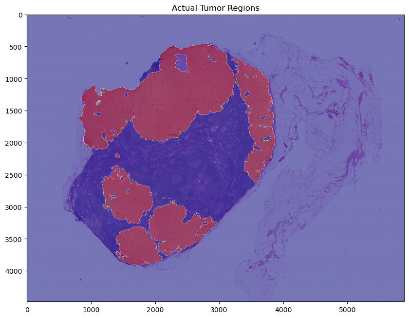

# Detecting Cancer Metastases on Gigapixel Pathology Images
The goal of theis project is to build a thoughtful, end-to-end prototype that detects breast cancer tumor from gigapixel pathology images - not to match the accuracy from the [paper](https://arxiv.org/abs/1703.02442), and not necessarily to use all the available data.

Considerations for the project:
- Use multiple zoom levels
- Use high-magnification images
- Include several visualizations of the prediction results (both heatmaps showing predictions on individual slides, and other metrics/diagrams to communicate how well the model performs).

